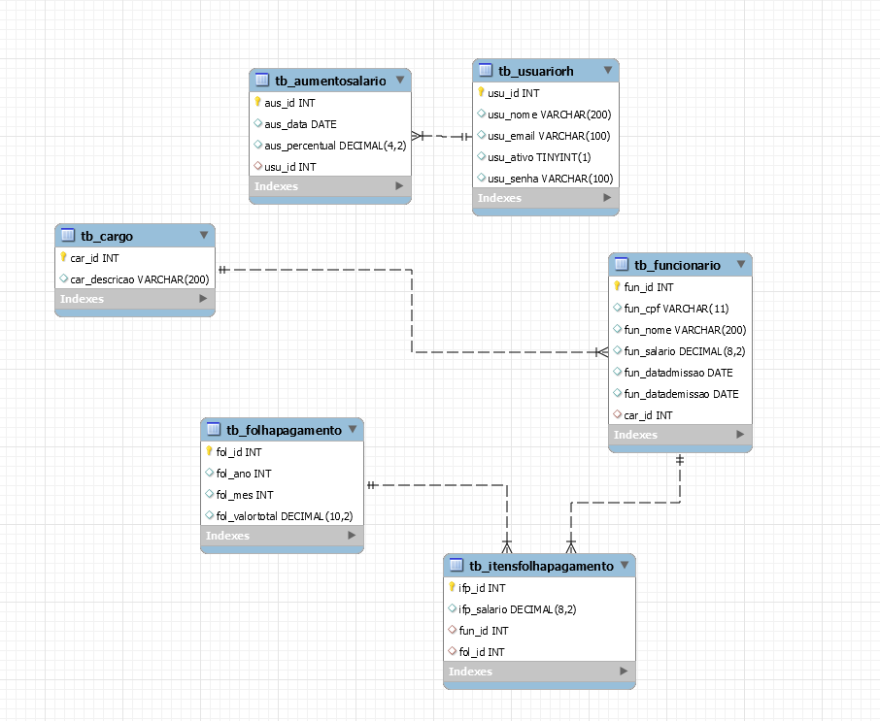

<h1 align="center">🏢 API de Gerenciamento Interno 🚀</h1>

  Bem-vindo(a) ao projeto da API para o sistema interno de gerenciamento de funcionários, folha de pagamento e aumento salarial! 🎉

  Você, com suas excelentes habilidades backend, foi escolhido(a) para construir esta solução incrível para o RH da empresa. 🛠️

## ⚙️ Funcionalidades da API

Esta API foi desenvolvida para atender às necessidades internas do RH da empresa, oferecendo as seguintes funcionalidades:

### 🧑‍💼 Gerenciamento de Funcionários

- **Cadastrar Funcionário:** Permite o registro de novos funcionários no sistema, preenchendo as informações da tabela `tb_funcionario`. A data de demissão (`fun_datademissao`) não é obrigatória no momento do cadastro. ➕
- **Excluir Funcionário (Lógica):** Realiza a "exclusão" de um funcionário atualizando a coluna `fun_datademissao` com a data e hora da requisição. Isso mantém o histórico de dados. 🗑️

### 💰 Aumento Salarial

- **Aplicar Aumento Percentual:** Permite aumentar o salário de todos os funcionários ativos (onde `fun_datademissao` é nulo) através de um percentual fornecido. 📈
- **Registro de Aumento:** Cada aumento aplicado é registrado na tabela `tb_aumentosalario`, armazenando a data da aplicação, o percentual utilizado e o usuário (`usu_id`) responsável pela ação. 📝

### 🧾 Folha de Pagamento

- **Gerar Folha de Pagamento:** Cria um registro na tabela `tb_folhapagamento` com o mês e ano de referência da folha, além de calcular e armazenar o valor total da folha (soma dos salários dos funcionários ativos no momento da geração). 🗓️
- **Itens da Folha de Pagamento:** Para cada funcionário ativo no momento da geração da folha, um registro é criado na tabela `tb_itensfolhapagamento`, detalhando o `fun_salario` do funcionário naquele momento e estabelecendo o relacionamento com o registro da `tb_folhapagamento` correspondente. 📄
- **Transação de Banco de Dados:** A geração da folha de pagamento utiliza transações no banco de dados para garantir a consistência dos dados. Se qualquer etapa da geração falhar, todas as alterações são desfeitas. 🛡️

### 🔑 Autenticação com JWT

- **Geração de Token JWT:** Implementa um endpoint específico para autenticar usuários do RH (com base nos registros da tabela `tb_usuariorh`) e gerar um JSON Web Token (JWT). 🗝️
- **Middleware de Validação JWT:** Todos os endpoints da API, exceto o de geração de token, são protegidos por um middleware que valida a autenticidade do JWT presente no cabeçalho da requisição. 🔒
- **Expiração do Token:** Os tokens JWT gerados possuem uma validade de 5 horas. ⏳

---

## 📝 Resumo das Funcionalidades

Em resumo, esta API oferece as seguintes funcionalidades principais:

- ✅ Cadastro e "exclusão lógica" de funcionários.
- ✅ Aplicação de aumento salarial percentual com registro histórico.
- ✅ Geração de folha de pagamento detalhada com garantia de consistência.
- ✅ Sistema de autenticação seguro com JWT.

---

## 🛠️ Próximos Passos

Com o modelo relacional em mãos e as funcionalidades definidas, o próximo passo é iniciar o desenvolvimento da API seguindo as boas práticas de codificação e os requisitos estabelecidos. 🚀

Sinta-se à vontade para explorar o modelo e começar a construir essa solução essencial para a empresa! 💪
